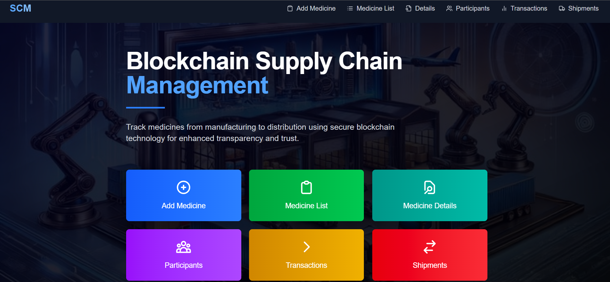
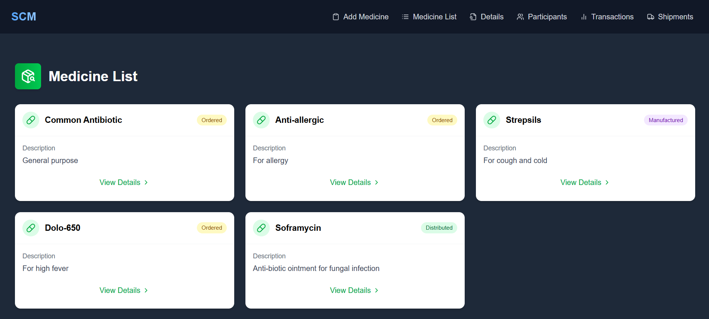
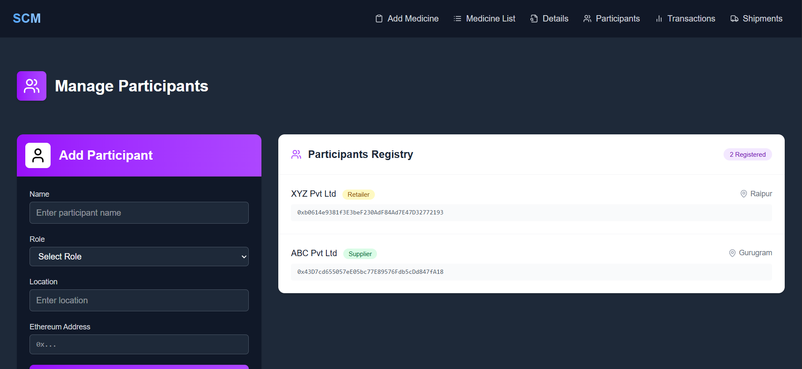

# Supply-Chain-Management-using-Blockchain-Technology

A full-stack decentralized supply chain management system using Solidity, Node.js, MongoDB, and React. It enables seamless tracking of medicines through various stages from manufacturing to retail with participant roles like Supplier, Manufacturer, Distributor, and Retailer.

## Smart Contract Features
Written in Solidity, the smart contract allows:

1. Adding Medicines
2. Registering Participants
3. Assigning participants to medicines
4. Tracking stages: Ordered → Raw Material Supplied → Manufactured → Distributed → Retail → Sold
5. Getting current medicine stage
6. Shipment creation and medicine transfer logging

## Tech Stack

1. Frontend: React + Vite + Tailwind CSS
2. Backend: Node.js + Express + Web3.js
3. Database: MongoDB with Mongoose
4. Blockchain: Solidity Smart Contract (Truffle / Ganache)

## Installation & Setup

1. Clone the repository
```bash
git clone https://github.com/greenhub/Task-Medicine-Supply-Chain-Management.git
cd Task-Medicine-Supply-Chain-Management
```

2. Setup MongoDB Atlas

* Create an account at MongoDB Atlas
* Create a free cluster and get your connection string
* Replace your .env variables as shown below

#### Environment Variables
* Create a .env file in server/ with (without quotes):

```js
MONGO_URI='mongodb+srv://<username>:<password>@cluster0.mongodb.net/supplychain?retryWrites=true&w=majority'
PORT=5000
CONTRACT_ADDRESS=0xYourDeployedContractAddress
BLOCKCHAIN_NODE_URL='http://127.0.0.1:7545'
OWNER_PRIVATE_KEY=0xYourGanachePrivateKey
```

#### Run the Application

1. Compile & Deploy Smart Contract
```bash
truffle compile
truffle migrate --reset
```

2. Start Backend
```bash
cd backend/
node server.js
```

3. Start Frontend
```bash
cd frontend/
npm run dev
```

## Key Features

1. Role-based Participant Registration
2. Medicine Lifecycle Management
3. Real-time Blockchain Tracking
4. Shipment Management & Status
5. Transaction History Tracking
6. Responsive, Modern UI with Tailwind CSS

## Website





## Future Improvements

1. User Authentication
2. QR Code Tracking
3. IPFS Integration for reports
4. Email Notifications

## License
This project is licensed under the MIT License.
